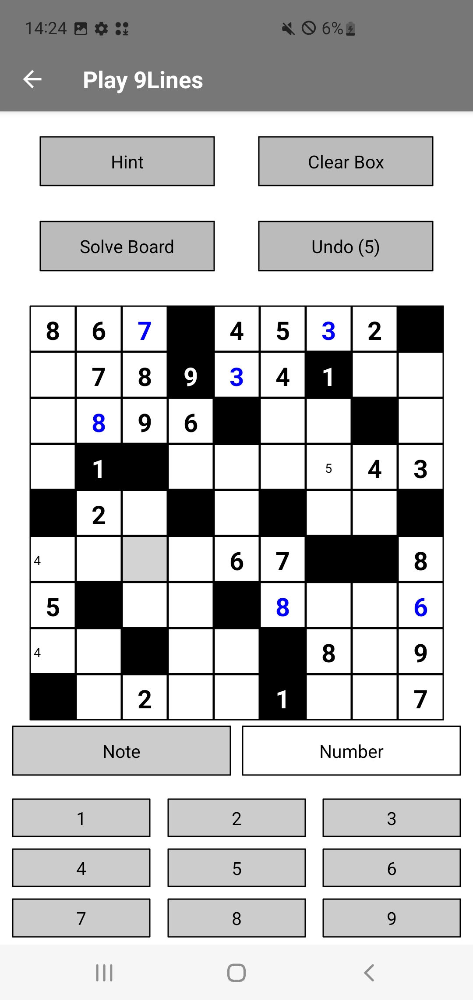

# 9Lines - A Str8ts-Inspired Numbers Puzzle Game

**9Lines** is an Android game that lets players enjoy the popular Str8ts numbers puzzle. Players can challenge themselves with endless puzzles across three difficulty levels (Easy, Medium, Hard) while utilizing advanced features like undo, note-taking, and hints to enhance gameplay. The app allows players to load new game configurations, ensuring a fresh challenge with every session. Progress can be tracked with an in-game counter that records how many puzzles have been completed.

### Key Features:
- **Three Difficulty Levels**: Choose from Easy, Medium, or Hard modes
- **Unlimited Puzzles**: Load new game configurations for endless fun
- **Advanced Game Options**: Undo, take notes, and use hints to guide your strategy
- **Progress Tracking**: Keep count of how many games you've completed

### About the Project:
This application was developed as part of the **Agile Projektarbeit** module during the **SoSe23 semester at Provadis Hochschule**. The goal was to apply agile development methodologies while building a fully functional mobile game. Through iterative sprints, the project was developed to offer a high-quality puzzle game experience, focusing on both engaging gameplay and agile project management techniques.

## Screenshot



## Installation of required software

Instructions to install and run the project on your local machine:
### Install Required Software:
1. Install IDE: Visual Studio Code and follow the installation instructions: https://code.visualstudio.com/download
2. Install NodeJs: https://nodejs.org/en/download
3. Install Git: https://git-scm.com/book/en/v2/Getting-Started-Installing-Git

### Download Project
1. Navigate to the folder where you want to store the project on your machine
2. Open a terminal in the directory and type: git clone XYZ

### Run development Server
1. Open VS Code and open the folder where you have stored your project
2. Open new terminal and type the following commands:
     
     ```npm install```
     
     ```npx expo start```

## Build instructions

To set up and build the **9Lines** application, use the command below:

```npx expo run:android```
